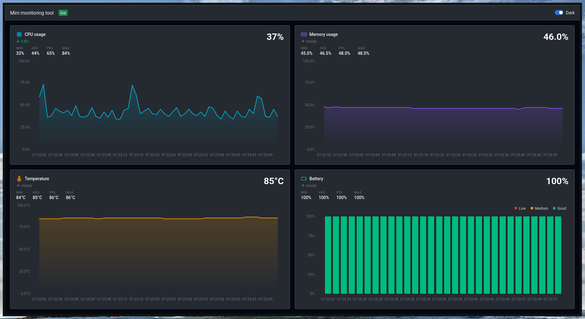

## Mini monitoring tool

Personal monitoring tool for my linux setup. Think of a simplified version of Grafana + Prometheus but fully local.



## System architecture

```
Metric collectors (Zig)
  main.zig        → ticker loop (1s aligned)
  cpu.zig         → reads /proc/stat           → POST /api/metrics/cpu
  memory.zig      → reads /proc/meminfo        → POST /api/metrics/memory
  temperature.zig → reads /sys/class/thermal   → POST /api/metrics/temperature
  battery.zig     → reads /sys/class/power_supply/BAT0/capacity → POST /api/metrics/battery
        │
        │ POST JSON every 1s
        ▼
Bun HTTP server (service/index.ts) :2697
        │
        ├── INSERT INTO SQLite (metrics.db)
        │
        └── broadcast via WebSocket (/ws)
        │
        ▼
Web dashboard (web/, Vite + React) at /web
  - CPU area chart
  - Memory spline-area chart
  - Temperature spline-area chart
  - Battery column chart (color-coded by level)
  - Per-card stats, trend, alerts and stale detection
```

## Stack

| Layer     | Tech                                                 | Role                                                               |
| --------- | ---------------------------------------------------- | ------------------------------------------------------------------ |
| Collector | Zig 0.16.0                                           | Reads Linux `/proc` and `/sys` pseudofiles, POSTs metrics every 1s |
| API       | Bun + TypeScript                                     | HTTP + WebSocket server, persists metrics to SQLite                |
| Storage   | SQLite (WAL mode)                                    | Time-series storage, auto-purges data older than 1 day             |
| Dashboard | Vite + React 19, Blueprint 6, Tailwind v4, Tremor Raw | Real-time cards and charts over WebSocket, light/dark theme        |

## Metrics collected

- **CPU usage** — percentage calculated from `/proc/stat` (stateful delta across ticks, sampled once per 1s tick)
- **Memory usage** — percentage from `MemTotal` / `MemAvailable` in `/proc/meminfo`
- **Temperature** — CPU thermal zone in °C from `/sys/class/thermal/thermal_zone0/temp`
- **Battery** — charge percentage from `/sys/class/power_supply/BAT0/capacity`

## Dashboard

- **Cards** — one per metric with an icon tinted to match its chart. The four cards split the viewport height on wide screens and stack on narrow ones.
- **Live data** — history is loaded from `/api/history`, then live points are appended from `/ws`. The socket reconnects automatically.
- **Windows** — the client keeps the last 120 readings per metric. Area charts draw the latest 60 and the battery chart the latest 30, while stats and alerts use all 120.
- **Theme** — a Dark switch in the navbar (remembered in `localStorage`, defaults to the OS setting). It toggles Blueprint's `bp6-dark` class, which Tailwind's `dark:` variant follows.

### Indicators

Each card shows the latest value, min / avg / p95 / max over the 120-reading window, and a trend arrow versus the previous minute's average. Alert thresholds (temperature has none; it idles hot on this machine) live in `web/src/lib/metrics.ts`:

| Metric      | Warning | Critical | Notes                            |
| ----------- | ------- | -------- | -------------------------------- |
| CPU         | ≥ 70%   | ≥ 90%    | must hold for 30s                |
| Memory      | ≥ 80%   | ≥ 90%    |                                  |
| Battery     | < 30%   | < 15%    | lower is worse                   |

Critical metrics also raise a banner at the top. A card with no reading for 5s is marked stale and dimmed, so a dead collector doesn't look like a flat line.

## API

| Method | Route                        | Description                                 |
| ------ | ---------------------------- | ------------------------------------------- |
| `POST` | `/api/metrics/cpu`           | Ingest CPU usage                            |
| `POST` | `/api/metrics/memory`        | Ingest memory usage                         |
| `POST` | `/api/metrics/temperature`   | Ingest temperature                          |
| `POST` | `/api/metrics/battery`       | Ingest battery level                        |
| `GET`  | `/api/history?metric=<name>` | Last 200 data points for a metric           |
| `WS`   | `/ws`                        | Real-time broadcast of all incoming metrics |
| `GET`  | `/web`                       | Web dashboard                               |

## Requirements

- [Zig](https://ziglang.org/download/) **0.16.0** (collectors are written against this version; other versions may fail to build)
- [Bun](https://bun.sh)

## How to run

1. Install service dependencies:

```sh
cd service && bun install
```

2. Start everything from the project root:

```sh
bash ./script.sh
```

This builds the dashboard (`web/`), starts the Bun API server, then waits for it to be ready before launching the Zig collector process (which runs all four collectors on a 1s tick via `main.zig`).

3. Open the dashboard at `http://localhost:2697/web`

### Frontend development

With the API running, start the Vite dev server for hot reload. It proxies `/api` and `/ws` to `:2697`:

```sh
cd web && bun install && bun run dev
```

Open `http://localhost:5173/web/`. The Bun server serves the production build from `web/dist` (`bun run build`, which also typechecks).

### Frontend layout

```
web/src/
  App.tsx               → navbar, alert banner, metric cards
  index.css             → Tailwind, Blueprint layer order, dark variant
  hooks/                → useMetrics (history + WebSocket), useDarkMode, useNow
  lib/metrics.ts        → per-metric title, icon, unit, alert thresholds
  lib/stats.ts          → summary stats, trend and alert-level logic
  components/           → Tremor Raw AreaChart and BarChart (copied in, edit freely)
```

### Frontend notes

- **Tremor Raw is copy-paste**, so the chart components are owned by this repo. Local changes: a `curve` prop on `AreaChart` (spline look) and a `red` chart color.
- **`react-is` is pinned to v19** in `web/package.json`. Tremor's charts use Recharts 2, which pulls `react-is@18`; with React 19 that leaves area series unrendered.
- **Blueprint's CSS is imported into a cascade layer** (`web/src/index.css`) below Tailwind's utilities, so Tailwind classes can override Blueprint's global styles.
